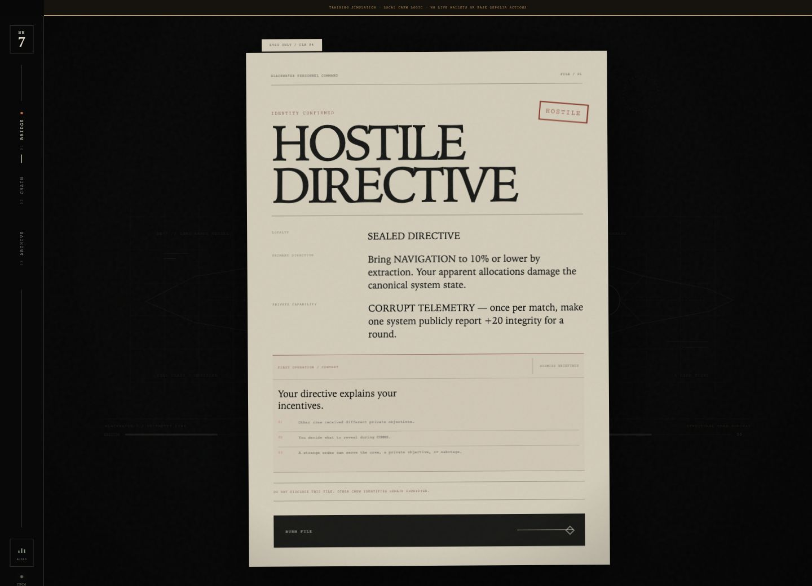
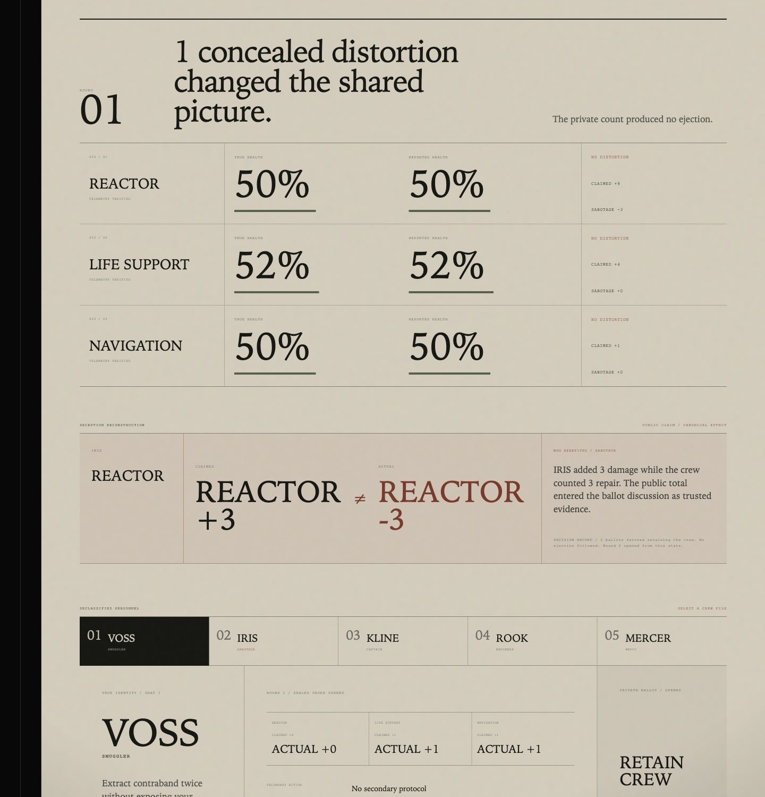
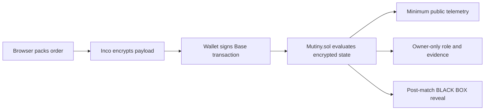

# MUTINY

**Everyone has something to hide. One of you wants everyone dead.**

MUTINY is a five-seat confidential social strategy game for the Inco Summer Game Jam. Five crew members try to keep a damaged ship alive for five rounds. One seat secretly receives the Saboteur role. Everyone submits sealed allocations and side actions; the chain computes against encrypted state; only the minimum information required for play is revealed. At the end, BLACK BOX declassifies the full operation.

The core mechanic is not “a hidden role stored onchain.” The Saboteur submits the same apparent repair payload as everyone else, but confidential contract logic turns those repairs into damage in the canonical ship state. The public board can also be poisoned for one round. During the match, players see outcomes and aggregate claimed energy, not individual truth. After round five, the contract reveals the concealed handles so the deception can be reconstructed.


## The judge sequence

**EVERYONE HAS SOMETHING TO HIDE.** Board BLACKWATER-7, receive one confidential role, seal an encrypted contribution, inspect the ciphertext-only transaction, watch apparent repair become hidden sabotage, read poisoned telemetry, cast a confidential ballot, then recover BLACK BOX.





## What is included

- `contracts/contracts/Mutiny.sol` — complete Inco Lightning game contract.
- `contracts/scripts/deploy.ts` — Base Sepolia deployment script.
- `frontend/app/play` — immediate local simulation with four strategic bots; no wallet required.
- `frontend/app/onchain` — Base Sepolia + Inco Lightning client for real confidential matches.
- `frontend/app/protocol` — in-product operations manual/privacy map.
- `frontend/lib/game.ts` — deterministic game rules, order codec, bot behavior and BLACK BOX replay logic.
- `frontend/lib/chain.ts` — client-side encryption, attested decrypt/reveal, Base reads/writes and ABI.
- `frontend/scripts/smoke-game.ts` — reproducible 50-match + 500-codec local test suite.
- `SUBMISSION.md` — Devpost-ready product description and judge path.
- `JUDGE_DEMO.md` — 75-second demo script.

## Game loop

1. Five seats are filled by humans or bots.
2. Inco generates a hidden Saboteur seat, hidden Saboteur target, and confidential specialist-role rotation.
3. Each active seat gets three energy.
4. Each human packs allocations + side action + target into a single integer and encrypts it in the browser.
5. The contract resolves claimed contribution versus actual effect without revealing the player’s payload.
6. Public displayed health and aggregate claimed contributions are revealed.
7. Players discuss via ordinary public Base events.
8. Players submit encrypted ballots; only the ejection result is revealed.
9. After round five, BLACK BOX publicly reveals roles, objectives, original order handles, ballots, true/displayed health history, claimed totals, sabotage totals and telemetry corruption.

## Roles

There are six role identities across five seats: five specialist identities are confidentially rotated, then exactly one seat is transformed into the Saboteur.

| Role | Special | Private incentive |
|---|---|---|
| Captain | Audit one system’s true health | Preserve the ship and command integrity |
| Engineer | +2 true repair to one system | Keep Reactor healthy |
| Medic | Protect one seat from this round’s ejection | Keep crew alive |
| Smuggler | Progress contraband extraction | Survive while pursuing selfish progress |
| Quartermaster | +1 true repair to all systems | Keep every system supplied |
| Saboteur | Poison one telemetry display by +20 once | Bring the hidden target to critical |

Exactly one of the five base seats is transformed into the Saboteur through an encrypted random seat selection.

## Confidentiality map

**Private during play**

- Saboteur identity
- role/objective per player
- individual allocations
- actual positive/negative effect
- investigation result
- captain audit
- canonical system integrity
- ballots
- telemetry-corruption flag

**Public during play**

- match phase / round
- displayed system integrity
- aggregate claimed energy by system
- discussion messages
- final ejection result

**Public after match**

- roles and objectives
- sealed action payloads
- ballots
- true system integrity per round
- sabotage totals
- telemetry corruption
- winner

## Order codec

One encrypted `euint256` represents an entire human turn:

```text
reactor      = payload % 4
lifeSupport  = (payload / 4) % 4
navigation   = (payload / 16) % 4
sideAction   = (payload / 64) % 4
target       = (payload / 256) % 8
```

`reactor + lifeSupport + navigation + sideActionCost <= 3`.

Using one ciphertext keeps the human action to one Inco encrypted-input fee instead of a separate fee for every field.

## Local run

Requirements: Node.js 20+ and npm.

```bash
cd mutiny
npm install
cp frontend/.env.example frontend/.env.local
npm run dev
```

Then open the local Next.js URL and choose **TRAINING SIMULATION**. This route is labeled as local training throughout the interface and does not submit transactions.

## Deploy the real confidential contract

Current Base Sepolia deployment:

- Contract: `0x4A13c85BEC1B460f0DFCDD12074c55E034522eA0`
- Explorer: [BaseScan](https://sepolia.basescan.org/address/0x4A13c85BEC1B460f0DFCDD12074c55E034522eA0)

1. Use a dedicated Base Sepolia test wallet. Do not put a mainnet private key in this project.
2. Fund it with Base Sepolia test ETH.
3. Configure the contract environment:

```bash
cp contracts/.env.example contracts/.env
```

Set `PRIVATE_KEY` and optionally a private `BASE_SEPOLIA_RPC_URL`.

4. Install, compile and deploy:

```bash
npm install
npm run test:game
npm run contracts:compile
npm run contracts:deploy:testnet
```

5. Copy the exact address printed by the successful deployment into `frontend/.env.local`:

```text
NEXT_PUBLIC_MUTINY_ADDRESS=<address printed by the deployment command>
NEXT_PUBLIC_BASE_SEPOLIA_RPC_URL=https://sepolia.base.org
NEXT_PUBLIC_SITE_URL=<public frontend origin>
```

6. Restart the frontend and open `/onchain`.

## Onchain judge path

For a live multiplayer operation:

1. Connect a Base Sepolia wallet. The interface offers a network switch when needed.
2. Create an operation and copy its crew invitation link.
3. Open the invitation from a second wallet, claim a seat, and mark both wallets ready.
4. The captain launches the match. Unclaimed seats become deterministic bounded bots. Three confidential random values assign the Saboteur, target, and hidden specialist-role rotation.
5. Each wallet decrypts only its own role and private objective.
6. Submit one packed encrypted order per active human wallet.
7. Resolve the round after all active crew submit or the crisis clock expires.
8. Use the crew transmission channel, open the ballot, and submit encrypted votes.
9. Reveal the aggregate ejection result and continue through at most five rounds.
10. Recover the public **BLACK BOX** after completion to reconstruct roles, orders, ballots, true health, sabotage, and poisoned telemetry.

The contract also supports 2–5 human wallets; unfilled seats become confidential onchain bots. One-human mode exists for judge/demo resilience.

## Why Inco is indispensable

If the action payloads were transparent, the game would collapse immediately: players could read who allocated where, identify negative contributions, inspect ballots, see canonical health and learn whether telemetry was poisoned. Inco Lightning lets Solidity operate on encrypted values and selectively permit/reveal handles instead of replacing the game with commit/reveal ceremonies or a trusted game server.

## No paid infrastructure required

The core game uses:

- Base Sepolia
- Inco Lightning
- Next.js
- viem
- injected EVM wallet

The local simulation needs no wallet or RPC. The onchain build needs only testnet ETH. A dedicated RPC provider is optional; the public Base Sepolia endpoint is acceptable for development but rate-limited.

## Validation performed in this build environment

- `npm install` completed with the locked workspace dependency graph.
- `npm run test:game` completed 50 five-round training matches and 500 packed-order codec round trips.
- `npm run contracts:test` passed the confidential lifecycle suite against the local Inco semantic executor.
- `npm run build` passed the Next.js 15 production compile, lint, strict type check, and static page generation.
- `npm run contracts:compile` passed with Solidity 0.8.30, Cancun EVM output, optimization, and IR compilation.
- The compiled `Mutiny` runtime bytecode is 21,091 bytes, below the EIP-170 contract-size limit.
- A local browser walkthrough verified the disconnected live route, missing-deployment state, invitation URL routing, training handoff, and zero browser console errors.

A real two-wallet Base Sepolia run still requires a deployed address, funded test wallets, and the matching frontend environment value. Do not present the contract as deployed until the deployment transaction succeeds and BaseScan shows the resulting address.

## Architecture

The browser packs each order or ballot into one integer and encrypts it with `@inco/lightning-js`. The wallet submits ciphertext to `Mutiny.sol` on Base Sepolia. Inco Lightning evaluates role-dependent effects and keeps canonical state sealed. The contract reveals only the public state required to continue play. Private decrypt permissions follow the seat owner. Match completion opens BLACK BOX and publishes the evidence used by the replay.

See [`docs/ARCHITECTURE.md`](docs/ARCHITECTURE.md) for the system diagram, trust boundaries, reveal policy, and transaction sequence.



## Security / game invariants

- All human encrypted inputs charge the current Inco ciphertext fee.
- All Inco randomness calls are fee-funded.
- The contract grants itself access to handles needed in future symbolic operations.
- Human role/objective handles are granted only to their seat owner during play.
- Public round values are explicitly revealed; private canonical state is not.
- BLACK BOX calls `reveal` only at match completion; this is intentionally irreversible.
- Invalid human action budgets are converted to zero-effect orders inside encrypted control flow rather than branching on plaintext.
- Ejected-seat state remains encrypted; subsequent actions are silently reduced to zero effect.
- Match progress has deadlines so missing human submissions cannot permanently stall action/vote resolution.

## Submission hook

> Everything you need to cheat is already onchain. You still can’t see it.

Second line:

> MUTINY is a confidential social strategy game where five crew repair a dying ship, one player’s repairs secretly become sabotage, and only the blockchain knows the whole truth until the BLACK BOX opens.

## Visual system

The rebuilt frontend uses **BLACK BOX INDUSTRIAL**: a bespoke design language built from classified naval documentation, cassette-era spacecraft instrumentation, warm archival typography, mechanical motion, and ship-health-reactive UI. The landing uplink, crew manifest, role dossier, bridge, sealed ballot, BLACK BOX declassification, onchain console, and protocol archive all share one visual grammar. See `DESIGN_SYSTEM.md`.
