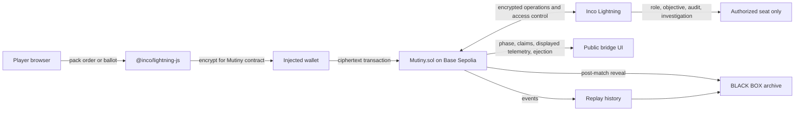

# MUTINY architecture

MUTINY runs the authoritative match state in `Mutiny.sol` on Base Sepolia. Inco Lightning protects the information whose early disclosure would solve the social game.

## Trust boundaries

- The wallet signs every state-changing action.
- The browser never receives another seat's private role, objective, audit, investigation, order, or ballot during play.
- A blockchain observer sees encrypted payload bytes and public events, not readable allocations or votes.
- The contract owns future-operation access to encrypted handles.
- Each human seat receives access only to the handles needed for its private dossier and field report.
- BLACK BOX reveal starts only after the match reaches its terminal phase.

## Confidential state

Inco protects the Saboteur seat, specialist rotation, private objective, packed human order, actual signed contribution, canonical system health, audit, investigation, ballot, ejection logic inputs, and telemetry-corruption state.

The public match state contains the phase, round, deadlines, aggregate claimed allocation, displayed telemetry, public COMMS, aggregate ejection result, and terminal winner.

## One encrypted order

The client packs reactor, life support, navigation, side action, and target into one `euint256` payload. One packed ciphertext reduces encryption fees and transaction size while preserving the complete action space.

## Reveal policy

During play, the contract reveals only displayed system health, aggregate claimed contribution, and the aggregate ejection result. Private role and evidence handles use owner-scoped access. After completion, BLACK BOX irreversibly reveals roles, objectives, orders, ballots, audits, investigations, canonical health, reported health, sabotage, telemetry corruption, ejections, and the winner.

## Release targets

- Solidity 0.8.30
- Cancun EVM output
- Inco Lightning 0.7.7 contract package
- `@inco/lightning-js` 1.0.2 browser package
- viem 2.39.3
- Next.js 15.5.23 and React 19.1.1
- Base Sepolia, chain ID 84532
